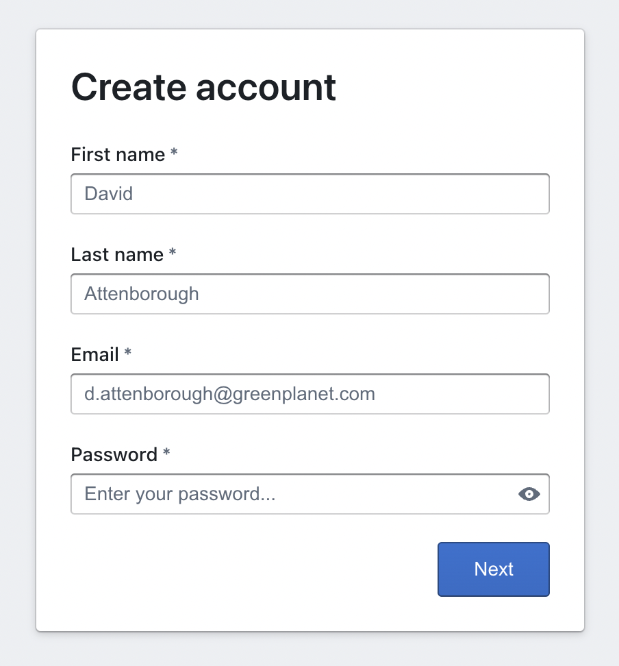
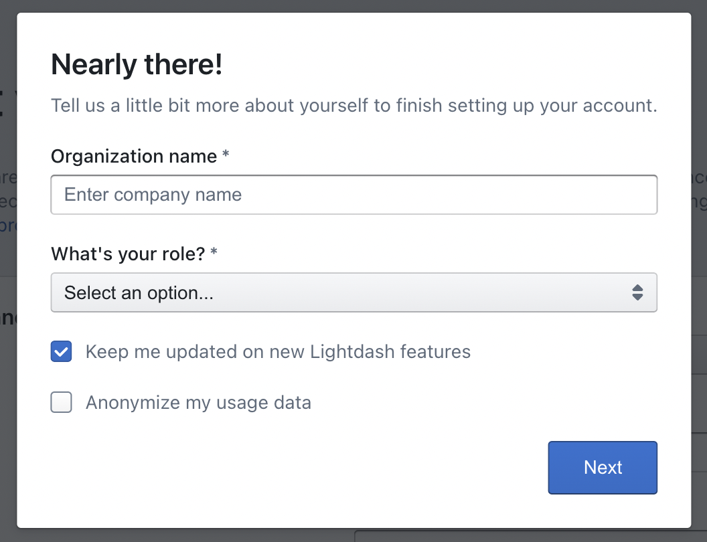
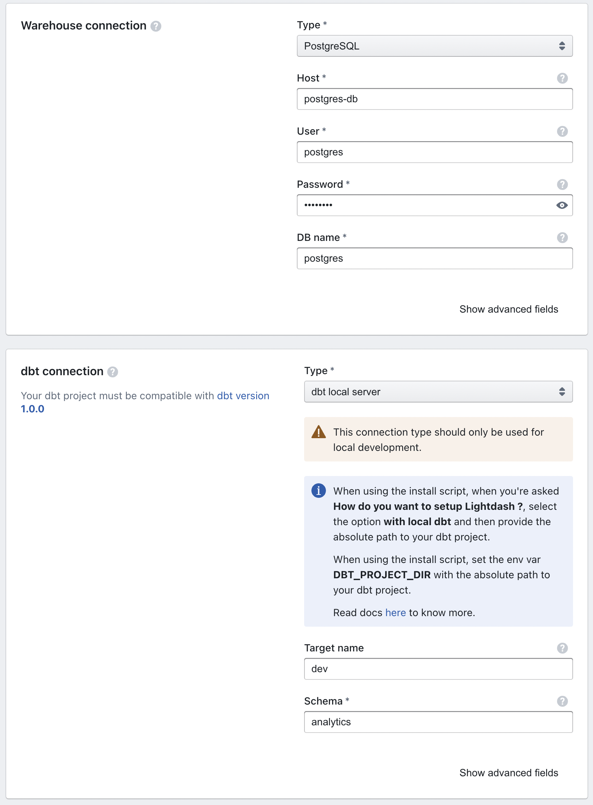
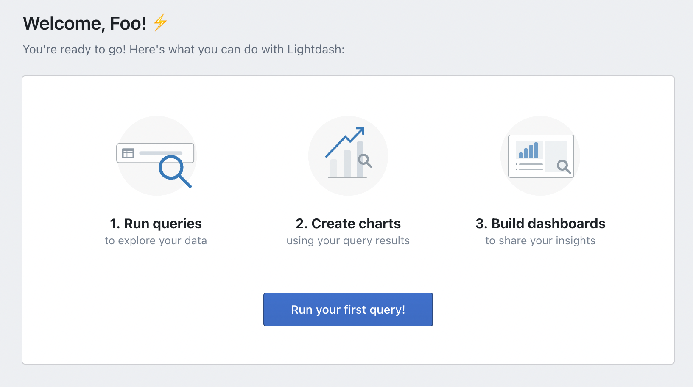

# Lightdash dbt Demo

A quick (small) example of how [Lightdash](https://github.com/lightdash/lightdash) and
[dbt](https://github.com/dbt-labs/dbt-core) can be used together in a local project.

The data used in this example is from the famous [Jaffle Shop](https://github.com/dbt-labs/jaffle_shop).

The repo is to illustrate how you can produce an entire analytics workflow locally, from the
initial modeling, to database administration, documentation site, and front-end visualization
engine.

## Acknowledgments

Thank you to the [Lightdash](https://www.lightdash.com/) team for putting together [this repo](https://github.com/lightdash/lightdash-production-example) showing how
how to release this project in GCP. If you want something that can run in the cloud, you should
check there.

## How To Run

1. Clone repo

2. Ensure you have [Docker](https://docs.docker.com/get-docker/) running and
[Docker Compose](https://docs.docker.com/compose/install/) installed.

3. Run `$ LIGHTDASH_SECRET="not very secret" PGPASSWORD="password" docker-compose -f dock
er-compose.yml up --build --force-recreate --detach --remove-orphans`
  * If you change `PGPASSWORD` here, make sure you update other references within the project

4. See below to determine which part of the project you want to access.

## Accessing the Projects

After the `docker-compose` has finished building and launching, you should have
access to three service running locally.

1. Lightdash at [http://localhost:8080/](http://localhost:8080/)
  * The core analytics tool

2. dbt docs at [http://localhost:8899/](http://localhost:8899/)
  * Documentation website for the dbt models being used in Lightdash

3. pgAdmin at [http://localhost:5050/](http://localhost:5050/)
  * Postgres admin tool, to look into the data being transformed and saved.
  * Login and password can be found [here](./docker-compose.yml#L57-L58)

### Lightdash

At the initial login, you'll need to create a local account within your
Lighdash instance. You can put in any email and password you like.

Next you'll be asked to enter your organization's name. Again,
you can choose anything you like.

Your connection details should match below. The connection and build process
of this step should take around 1 minute.

  * Warehouse Connection:
    * Type: Postgres
    * Host: postgres-db
    * Password: password
    * DB Name: postgres
    * Port: 5432
    * SSL Mode: Disable / None

  * dbt Connection
    * Type: dbt local server
    * Target Name: dev
    * Schema: analytics

Finally, select `Show Entire Project` and you're ready to explore the Jaffle Shop.

### dbt Docs

One of the best parts of dbt is you get the documentation (mostly) for free. If you're
new to dbt or their docs, there is a good write up [here](https://docs.getdbt.com/docs/building-a-dbt-project/documentation)
on what to expect.

### pdAdmin

[pgAdmin](https://www.pgadmin.org/) is a web-based GUI tool used to interact with the Postgres database sessions.
